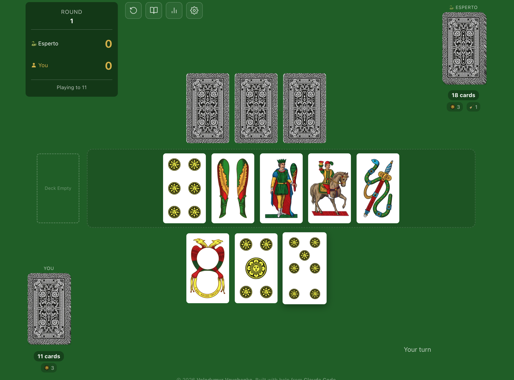
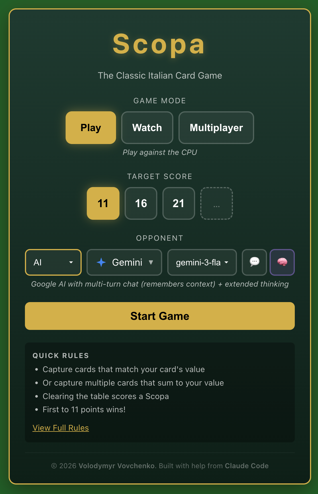
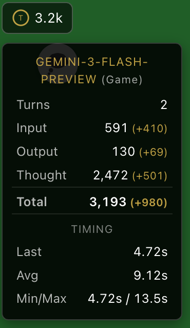
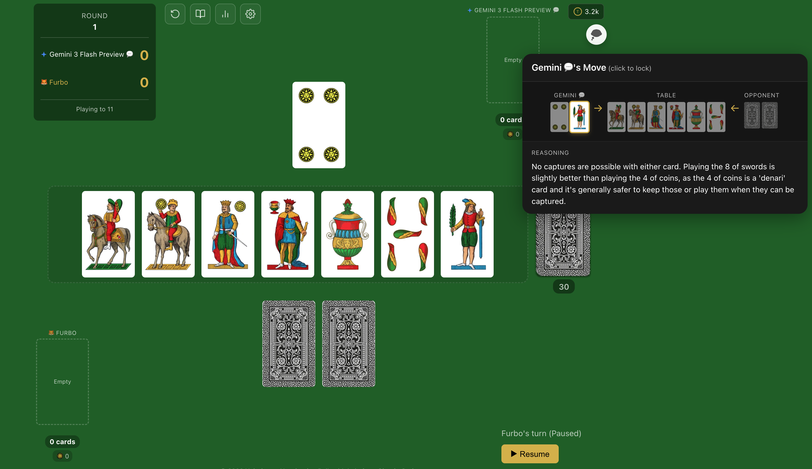
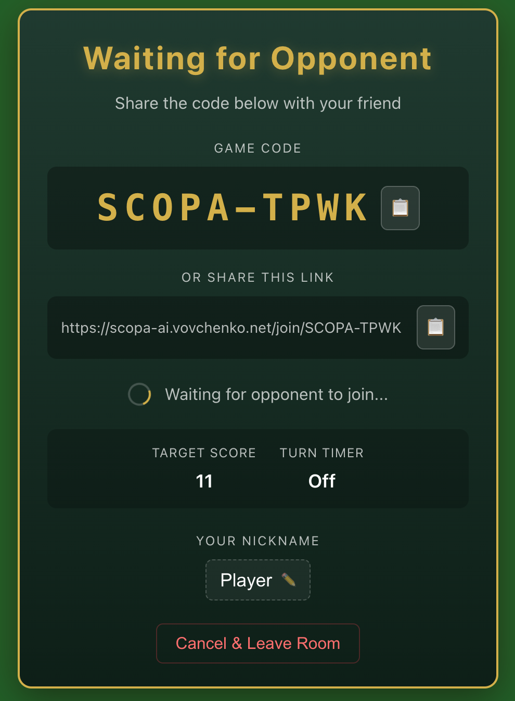

# Scopa AI

A web-based implementation of the classic Italian card game **Scopa**, featuring CPU opponents of varying difficulty and AI opponents powered by LLMs (Gemini, GPT, Claude), real-time multiplayer, and spectator mode to watch CPU/AI vs CPU/AI battles.



<p align="center"><b><a href="https://scopa-ai.vovchenko.net">Play Now</a></b></p>

---

## About

This is a continuation of [vlvovch/scopa](https://github.com/vlvovch/scopa), which implemented the core Scopa game with CPU opponents. This project extends it with:

- **LLM AI opponents** (Gemini, GPT, Claude) that can reason about the game
- **Real-time multiplayer** via WebSocket server
- **Watch mode** for spectating CPU/AI vs CPU/AI battles

As a physicist who uses code as a tool for research a lot but has limited background in web development, during the winter break I wanted to explore how far AI coding assistants could take me in building a complete, polished web application, in the future I plan to use this project as a basis for building more complex physics applications.
The codebase was developed using [Claude Code](https://claude.ai/code) - Anthropic's agentic coding tool. 
Every feature, from the game engine to the WebSocket multiplayer server, was built through supervised conversation with Claude, with small bits of code written by me. 
As such I am not an expert in any of the technologies used in this project, but I am quite happy with what I was able to build with the help of AI.

---

## Features

### Game Modes



- **Player vs CPU** - Play against built-in CPU opponents (no setup required)
- **Player vs AI** - Play against LLM-powered AIs (requires API keys)
- **Watch Mode** - Spectate AI vs AI, AI vs CPU, or CPU vs CPU battles
- **Multiplayer** - Play against friends online with real-time WebSocket connections

<br clear="right"/>

### CPU Opponents

| CPU | Description |
|-----|-------------|
| Scimmietta | Random moves (for testing) |
| Furbo | Greedy heuristic strategy |
| Esperto | Expert ISMCTS (Monte Carlo Tree Search) |

### LLM AI Opponents



| AI | Description |
|----|-------------|
| Gemini | Google's Gemini LLM with multi-turn chat |
| GPT | OpenAI's GPT models with Responses API |
| Claude | Anthropic's Claude with extended thinking |

LLM AIs support both multi-turn conversation mode (context preserved across moves) and single-turn mode (full history sent each request). Requires API keys (see below).
The app shows token usage accumulated during the game.

One can pick a model for each AI independently based on API support and cost considerations.
Advanced models with thinking modes can be significantly slower and more expensive than simpler models, with limited gain, so it's worth experimenting to find the right balance.
In pratice, gemini-3-flash-preview shows good balance of speed (few secs per move) and performance (plays at Furbo level).

<br clear="right"/>

In Watch Mode, you can view the AI's reasoning for each move:



### Gameplay Features

- Default Scopa rules implementation (mandatory capture, single-card priority, scopa scoring)
- Mobile and browser-friendly responsive design
- Drag-and-drop card interactions with flip animations
- Sound effects for dealing, capturing, and celebrations
- Game statistics tracking with W/L records against each opponent
- Multiple Italian card decks (Napoletane, Siciliane, Piacentine, Bergamasche, Sarde, Romagnole)
- Progressive Web App (PWA) support for offline play (CPU opponents only)

---

## Quick Start

### Play Online

Visit **[scopa-ai.vovchenko.net](https://scopa-ai.vovchenko.net)** to play immediately. No installation required.

For AI opponents (Gemini, GPT, Claude), you'll need to provide your own API keys in Settings. Keys are stored locally in your browser and API calls go directly to the providers.

### Run Locally

```bash
# Clone the repository
git clone https://github.com/vlvovch/scopa-ai.git
cd scopa-ai

# Install dependencies
npm install

# Start development server
npm run dev
```

The app will be available at `http://localhost:5173` (port may vary, see the logs after running the command).

---

## API Keys for AI Opponents

To play against LLM-powered AI opponents, you need API keys from the respective providers:

| Provider | Get API Key | Environment Variable |
|----------|-------------|---------------------|
| Google Gemini | [aistudio.google.com](https://aistudio.google.com/apikey) | `VITE_GEMINI_API_KEY` |
| OpenAI | [platform.openai.com](https://platform.openai.com/api-keys) | `VITE_OPENAI_API_KEY` |
| Anthropic Claude | [console.anthropic.com](https://console.anthropic.com/) | `VITE_CLAUDE_API_KEY` |

### Option 1: In-App Settings

Add your API keys in the Settings modal. Keys are stored in your browser's localStorage and never transmitted to any server except when querying the AI provider.

### Option 2: Environment Variables

Create a `.env.local` file in the project root:

```bash
# Copy the example file
cp .env.local.example .env.local

# Edit with your keys
VITE_GEMINI_API_KEY=your-gemini-api-key
VITE_OPENAI_API_KEY=your-openai-api-key
VITE_CLAUDE_API_KEY=your-claude-api-key
```

---

## Multiplayer

The multiplayer mode uses a lightweight WebSocket server for real-time gameplay.

### Running the Multiplayer Server

```bash
cd scopa-server

# Install dependencies
npm install

# Build and start
npm run build
npm start

# Or for development with auto-reload
npm run dev
```

The server runs on port 8080 by default. Configure the client to connect via:

```bash
VITE_WS_URL=ws://localhost:8080
```

### Multiplayer Features



- Matchmaking through a shareable game code
- Session persistence (reconnect after page refresh)
<!-- - Turn timer with configurable duration -->

<br clear="right"/>

---

## Technology Stack

| Technology | Purpose |
|------------|---------|
| React 18 | UI framework |
| TypeScript | Type safety |
| Vite | Build tool & dev server |
| Framer Motion | Card animations |
| WebSocket (ws) | Multiplayer server |
| Vitest | Unit testing |

### AI SDKs

- `@google/genai` - Gemini API
- `openai` - OpenAI Responses API
- `@anthropic-ai/sdk` - Claude Messages API

---

## Project Structure

```
scopa-ai/
├── src/
│   ├── ai/              # AI opponent implementations
│   ├── components/      # React UI components
│   ├── game/            # Game logic (rules, scoring, deck)
│   ├── hooks/           # React hooks (useGame, useMultiplayer, etc.)
│   ├── multiplayer/     # Multiplayer types
│   └── workers/         # Web Workers for background simulation
├── scopa-server/        # Multiplayer WebSocket server
├── public/              # Static assets (cards, sounds)
└── docs/                # Design documentation
```

---

## Development

```bash
# Start dev server
npm run dev

# Run tests
npm test

# Run tests in watch mode
npm run test:watch

# Production build
npm run build

# Preview production build
npm run preview

# Lint code
npm run lint
```

### CLI Simulation Tool

Run AI vs AI simulations from the command line:

```bash
# Run 100 games: Heuristic vs Random
npm run simulate -- -p1=heuristic -p2=random -g=100

# Run with LLM AIs
npm run simulate -- -p1=gemini -p2=claude -g=10 -v

# Save results to JSON
npm run simulate -- -p1=expert -p2=heuristic -g=50 -o=results.json
```

---

## Scopa Rules Quick Reference

- **40-card Italian deck**: 4 suits (Coins, Cups, Swords, Clubs), values 1-10
- **Objective**: Capture cards from the table by matching values
- **Mandatory capture**: If you can capture, you must
- **Single-card priority**: Single match takes precedence over sum combinations
- **Scopa**: Clearing the table earns 1 bonus point (except last play of the round)

### Scoring

| Category | Points | Condition |
|----------|--------|-----------|
| Carte | 1 | Most cards captured (21+) |
| Denari | 1 | Most Coins suit (6+) |
| Sette Bello | 1 | Capture the 7 of Coins |
| Primiera | 1 | Highest prime score |
| Scopas | 1 each | Table sweeps during play |

### Prime (Primiera) Values

| Card | Value |
|------|-------|
| 7 | 21 |
| 6 | 18 |
| Ace | 16 |
| 5 | 15 |
| 4 | 14 |
| 3 | 13 |
| 2 | 12 |
| Face cards (8-10) | 10 |

---

## Acknowledgments

- Built with [Claude Code](https://claude.ai/code)
- Card graphics from [Wikimedia Commons](https://commons.wikimedia.org/) (public domain)
- Sound effects from [Kenney.nl](https://kenney.nl/) (CC0 license)
- Original inspiration from [vlvovch/scopa](https://github.com/vlvovch/scopa) (built with OpenAI Codex and Claude Code)
